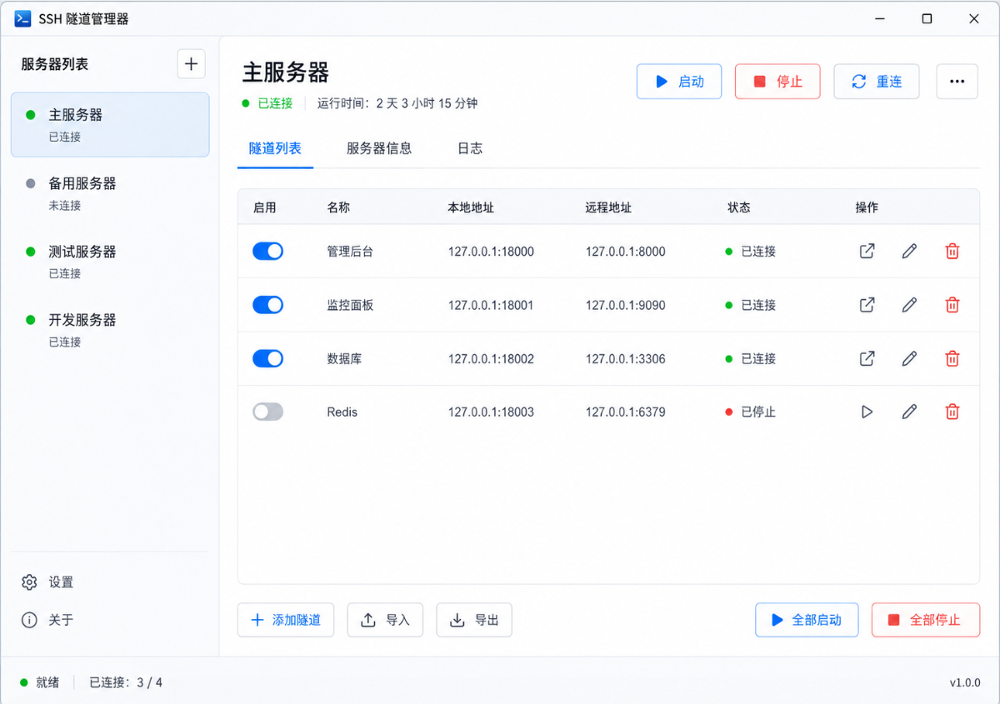

# TunnelDock

一个轻量的 Windows 托盘 SSH 隧道管理器，专注管理多个 SSH 服务器和本地端口转发。

TunnelDock is a lightweight Windows tray app for managing multiple SSH local port-forwarding tunnels.



## 核心特性

- 多服务器管理：一个界面管理多个 SSH 服务器。
- 多隧道管理：每个服务器可配置多个本地端口转发。
- 一个服务器一个 SSH 进程：同一服务器下的多个 `-L` 转发复用同一个 `ssh.exe` 进程。
- Windows 托盘常驻：关闭窗口后可最小化到系统托盘。
- 开机自启：支持登录 Windows 后自动启动应用。
- 自动重连：SSH 进程异常退出后按退避策略自动重连。
- 一键打开本地服务：为隧道配置 `openUrl` 后可直接打开本地管理页面。
- JSON 配置：配置保存在本地，方便备份和迁移。
- 安全优先：不保存 SSH 密码、不保存私钥 passphrase，默认监听 `127.0.0.1`。
- 中英切换：界面默认中文，支持切换到 English。

## 适合谁用

TunnelDock 适合经常通过 SSH 本地端口转发访问服务器内部服务的人，例如：

- 通过 `127.0.0.1:18000` 访问远程管理后台。
- 通过 `127.0.0.1:18001` 访问远程监控面板。
- 通过 `127.0.0.1:18002` 临时访问远程数据库端口。
- 希望这些转发常驻托盘、断线自动恢复、开机自动启动。

它不是 FinalShell，也不是 MobaXterm。它只做一件事：管理 SSH 本地端口转发。

## 技术栈

| 部分 | 技术 |
| --- | --- |
| 桌面框架 | Tauri 2 |
| 前端 | React + TypeScript + Vite |
| 后端 | Rust |
| SSH | Windows OpenSSH `ssh.exe` |
| 配置 | 本地 JSON 文件 |
| 托盘/自启 | Tauri tray + autostart plugin |

## 下载安装

如果仓库已经发布 Release，请优先下载 Release 中的安装包：

- `TunnelDock_0.1.0_x64-setup.exe`
- `TunnelDock_0.1.0_x64_en-US.msi`

也可以使用免安装版本：

```text
src-tauri/target/release/tauri-app.exe
```

## 从源码构建

### 环境要求

- Windows 10 / Windows 11
- Windows OpenSSH Client，可在 PowerShell 中运行 `ssh -V` 验证
- Node.js + pnpm
- Rust toolchain
- Tauri 2 所需 Windows 构建依赖

### 安装依赖

```powershell
pnpm install
```

### 开发运行

```powershell
pnpm tauri dev
```

### 构建安装包

```powershell
pnpm tauri build
```

构建完成后产物位于：

```text
src-tauri/target/release/bundle/nsis/
src-tauri/target/release/bundle/msi/
```

## 快速使用

1. 打开 TunnelDock。
2. 点击左侧 `+` 添加服务器。
3. 填写 SSH 地址、端口、用户名和私钥路径。
4. 为服务器添加一个或多个隧道。
5. 点击 `启动`，TunnelDock 会生成参数数组并启动 `ssh.exe`。
6. 如果隧道配置了 `openUrl`，可在隧道列表中一键打开本地服务。

示例隧道：

```text
127.0.0.1:18000 -> 127.0.0.1:8000
127.0.0.1:18001 -> 127.0.0.1:9090
127.0.0.1:18002 -> 127.0.0.1:3306
```

对应 SSH 参数类似：

```powershell
ssh.exe -N `
  -o ServerAliveInterval=30 `
  -o ServerAliveCountMax=3 `
  -o ExitOnForwardFailure=yes `
  -o BatchMode=yes `
  -i "C:\Users\you\.ssh\id_ed25519" `
  -L 127.0.0.1:18000:127.0.0.1:8000 `
  -L 127.0.0.1:18001:127.0.0.1:9090 `
  root@example.com `
  -p 2222
```

## 配置文件

配置文件位置：

```text
%APPDATA%\ssh-tunnel-tray\config.json
```

日志目录：

```text
%APPDATA%\ssh-tunnel-tray\logs\
```

配置示例：

```json
{
  "version": 1,
  "app": {
    "startMinimized": true,
    "closeToTray": true,
    "launchAtLogin": true,
    "theme": "system"
  },
  "servers": [
    {
      "id": "main-server",
      "name": "主服务器",
      "sshHost": "example.com",
      "sshPort": 2222,
      "sshUser": "root",
      "privateKey": "C:\\Users\\you\\.ssh\\id_ed25519",
      "useAgent": true,
      "autoStart": true,
      "autoReconnect": true,
      "reconnectDelaySec": 5,
      "enabled": true,
      "tunnels": [
        {
          "id": "panel",
          "name": "管理后台",
          "enabled": true,
          "localHost": "127.0.0.1",
          "localPort": 18000,
          "remoteHost": "127.0.0.1",
          "remotePort": 8000,
          "openUrl": "http://127.0.0.1:18000"
        }
      ]
    }
  ]
}
```

## 安全说明

TunnelDock 第一版坚持以下限制：

- 不保存服务器密码。
- 不保存私钥 passphrase。
- 不内置 SSH 协议实现，只调用系统 `ssh.exe`。
- 不默认添加 `StrictHostKeyChecking=no`。
- 本地监听地址默认使用 `127.0.0.1`，避免局域网其他设备访问你的转发端口。

推荐使用：

- 私钥登录。
- `ssh-agent`。
- 已确认过 host key 的服务器。

## 常见问题

### 应用打开后看不到窗口

请检查系统托盘中是否已有 TunnelDock 图标。新版默认显示主窗口；如果你设置了启动后最小化，可从托盘菜单打开主界面。

### 启动服务器失败

请先查看日志页，常见原因包括：

- Windows 找不到 `ssh.exe`。
- 私钥路径错误。
- 服务器没有配置公钥登录。
- 首次连接尚未确认 host key。
- 本地端口已被占用。

### 端口被占用怎么办

修改隧道的 `localPort`，或停止占用该端口的本地程序。TunnelDock 会检查同一配置中的重复端口，并在启动前检查端口可用性。

### 为什么不支持密码登录

为了避免保存 SSH 密码和私钥 passphrase，第一版只支持私钥或 ssh-agent 工作流。

## 开发命令

```powershell
pnpm test
pnpm tsc --noEmit
cd src-tauri
cargo test
```

## 当前状态

TunnelDock 目前是 Windows 优先的本地桌面应用。macOS / Linux 适配、远程终端、SFTP、云同步、团队共享不在第一版范围内。

## License

如果你计划开源，请在仓库中补充 `LICENSE` 文件。
